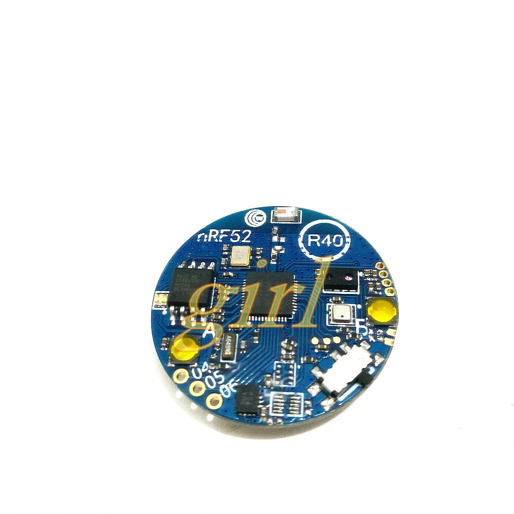

Sensor R40 board pins reverse-engineered
========================================

This boards have no names, can be found on Aliexpress with following search keys:

> Bluetooth 5 Bluetooth 4 NRF52832\_SENSOR\_R40 acceleration gyroscope ambient light sensor

I bought that board here: [aliexpress: sincere girl store](https://ru.aliexpress.com/item/Bluetooth-5-Bluetooth-4-NRF52832-SENSOR-R40-acceleration-gyroscope-ambient-light-sensor/32891351912.html?spm=a2g0v.10010108.1000016%2FB.1.277f7139TyiW9l&isOrigTitle=true)

Board have following chips:

- nRF52832 SoC
- BMP280 ow BME280 (in my case)
- MX25R8035 SPI Flash
- AP3216C light sensor (I^2C)
- BMI160 3d Accel/Gyro (I^2C)
- RGB LED (GPIO)

- 2 buttons (GPIO)
- 1 power switch
- CR2032 battery

Photo
-----

nRF52832 Pinout
---------------

| PIN | NAME | Function | Description |
|-----|------|----------|-------------|
|   1 | DEC1 | ROWER | |
|   2 | XL1  | LSE 32.768 kHz | |
|   3 | XL2  | LSE | |
|   4 | P0.2 | | ??? - res - via - Vcc - Voltage Monitor? |
|   5 | P0.3 | | Button KEY1 - pressed HIGH |
|   6 | P0.4 | | hole pad 05 |
|   7 | P0.5 | | hole pad 06 |
|   8 | P0.6 | | hole pad 07 |
|   9 | P0.7 | | ??? goes to BMI |
|  10 | P0.8 | | ??? goes to BMI |
|  11 | P0.9/NFC1 | | NFC pin 1|
|  12 | P0.10/NFC2 | | NFC pin 2 |
|-----|------|----------|-------------|
|  13 | VDD | POWER | |
|  14 | P0.11 | | SDA - BML & BMP |
|  15 | P0.12 | | SCL - BMI & BMP |
|  16 | P0.13 | | ??? - goes to BMP, then via|
|  17 | P0.14 | | n/c |
|  18 | P0.15 | | test pad 15 |
|  19 | P0.16 | | test pad 16 |
|  20 | P0.17 | | test pad 17 |
|  21 | P0.18 | | Button KEY0 - pressed HIGH |
|  22 | P0.19 | | SDA - AP & BME |
|  23 | P0.20 | | AP INT|
|  24 | P0.21 | | SCL - AP & BME |
|-----|------|----------|-------------|
|  25 | SWDCLK | SWD | SWD |
|  26 | SWDIO | SWD | SWD |
|  27 | P0.22 | | n/c |
|  28 | P0.23 | | n/c |
|  29 | P0.24 | | n/c |
|  30 | ANT | RF | ceramic antenna |
|  31 | VSS | POWER | |
|  32 | DEC2 | POWER | |
|  33 | DEC3 | POWER | |
|  34 | XC1 | HSE 16 MHz | |
|  35 | XC2 | HSE |
|  36 | VDD | POWER | |
|-----|------|----------|-------------|
|  37 | P0.25 | | flash pin 5 - SI |
|  38 | P0.26 | | flash pin 6 - SCK |
|  39 | P0.27 | | RGB R |
|  40 | P0.28 | | RGB G |
|  41 | P0.29 | | RGB B |
|  42 | P0.30 | | flash pin 1 - !CS |
|  43 | P0.31 | | flash pin 2 - SO |
|  44 | NC | n/a | |
|  45 | VSS | POWER | |
|  46 | DEC4 | POWER | |
|  47 | DCC | POWER | Not connected - no DC/DC |
|  48 | VDD | POWER | |
